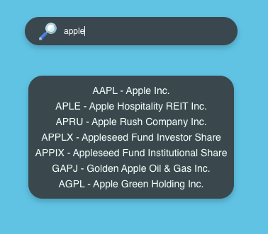
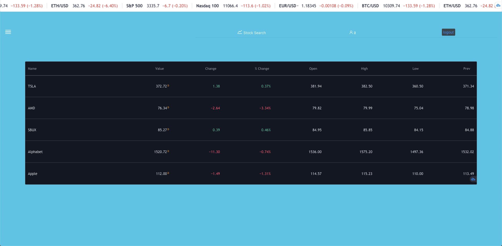

# Stock Search

Stock search is a dashboard to search and keep track of stocks.

[Live Demo](https://stock-tracker-be252.web.app/)

## Getting Started

**Running the Frontend:**

Clone this repo, and cd into the directory

*  `npm install`
*  `npm start`

or check out the [Live Demo](https://stock-tracker-be252.web.app/)

**Backend:** 

Hosted using firebase

backend code can be found in [stock-search-functions](https://github.com/ALmsq/stock-search-functions)

## Features

**Authentication**

Auth is implemented on the backend with Firebase auth. 

Authentication is managed on the frontend with Redux.js

**Alphavantage API**

Designed a search function to fetch stock symbol and name information from the Alphavantage API

**Tradingview widgets**

Stock real-time chart and ticker is displayed with tradingview's embedded widgets.

Stocks can be saved to watch on your user dashboard

## Technologies Used

**Frontend**
* React.js

    - Redux.js

    - Redux-Thunk

* Ant.Design
* Alphavantage API
* Tradingview widgets

**Backend**

* Firebase-React Stack

    - Node.js
    - Express.js
    - Firebase
    
* JWT Auth
