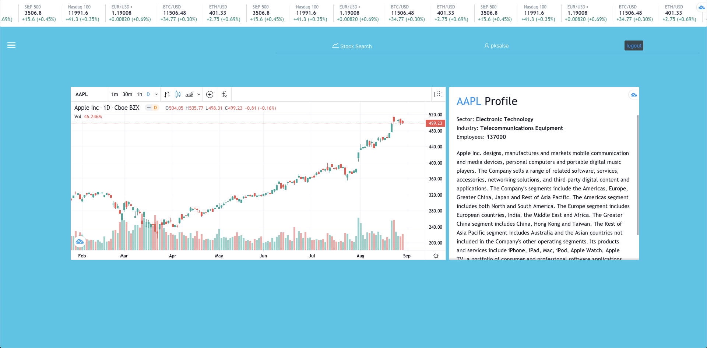

# Stock Search

Stock search is a dashboard to search and keep track of stocks.

## Getting Started

Clone this repo, and cd into the directory

Running the Frontend:

*  `npm install`
*  `npm start`

Backend: 

Clone into [stock-search-backend](https://github.com/ALmsq/stock-search-backend)

*  `npm install`
*  `npm start`

## Features

**Authentication**

Auth is implemented on the backend with Passport-jwt auth. 

Authentication is managed on the frontend with Redux.js

User sessions are persisted with jwt-token and decoded with bcrypt.

**Alphavantage API**

Designed a search function to fetch stock symbol and name information from the Alphavantage API

Stock real-time chart and ticker is displayed with tradingview's embedded widgets.

## Technologies Used

**Frontend**
* React.js

    - Redux.js

    - Redux-Thunk
* Ant.Design
* Alphavantage API
* Tradingview widgets

**Backend**

* MERN Stack

    - Node.js
    - Express.js
    - MongoDB
* Passport.js
* JWT Auth
* Bcrypt